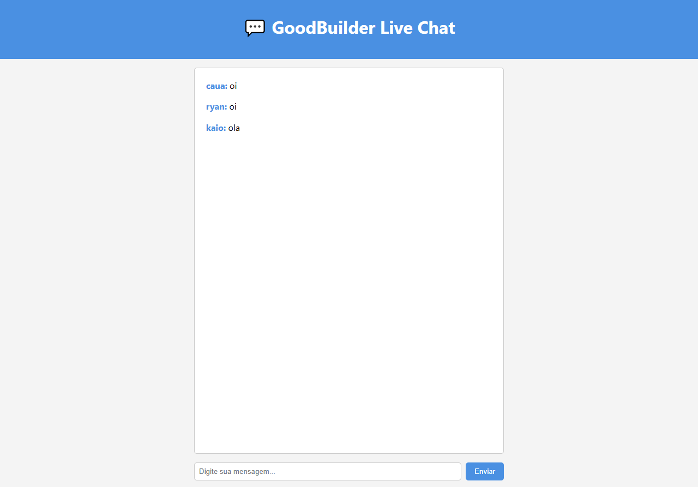

# Live Chat - WebSocket com STOMP

Este projeto é uma aplicação simples de chat em tempo real utilizando **Spring Boot**, **WebSockets** e **STOMP**. O objetivo é demonstrar a implementação básica de comunicação bidirecional entre o servidor e o cliente.
---

---

## Tecnologias

- **Java 24**
- **Spring Boot**
- **WebSocket**
- **STOMP**
- **SockJS**
- **HTML / CSS / JavaScript**

## Funcionalidades

- Envio e recebimento de mensagens em tempo real.
- O usuário se conecta ao chat fornecendo um **nickname**.

## Como Rodar

1. Clone o repositório.
2. Execute o backend com:  
   ```bash
   ./mvnw spring-boot:run
   ```
3. Abra `index.html` no navegador.

## Fluxo

1. O cliente se conecta ao WebSocket em `/chat`.
2. Envia mensagens para `/app/chat`.
3. As mensagens são transmitidas a todos os clientes inscritos em `/topic/chat`.

